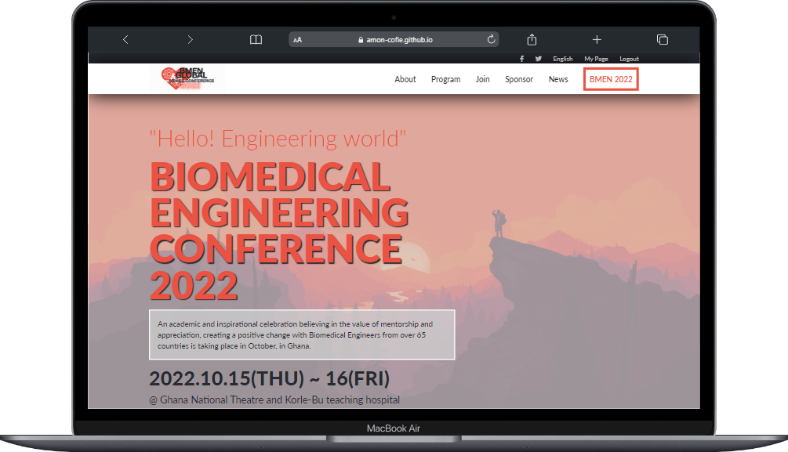
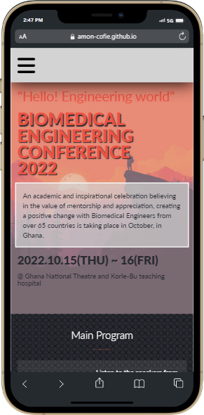

# first-capstone-project

## credits section

# First Capstone Project

> In this first capstone project, I created a page for a made up conference set to occur in October, 2022. With this project I showcase a cloned version of an original Behance design by Cindy Shin, taking inspiration from her use of colors, patterns and layouts

## Built With

- HTML
- CSS
- Javascript

## Live Demo

 
     

[See the project live](https://amon-cofie.github.io/first-capstone-project/)

## Getting Started

**This is an example of how you may give instructions on setting up your project locally.**
**Modify this file to match your project, remove sections that don't apply. For example: delete the testing section if the currect project doesn't require testing.**

To get a local copy up and running follow these simple example steps:

### Prerequisites

### Setup

### Install

### Usage

### Run tests

### Deployment

## Author

👤 **David Amon-Cofie**

- GitHub: [@githubhandle](https://github.com/githubhandle)
- Twitter: [@twitterhandle](https://twitter.com/twitterhandle)
- LinkedIn: [LinkedIn](https://linkedin.com/in/linkedinhandle)

## 🤝 Contributing

Contributions, issues, and feature requests are welcome!

Feel free to check the [issues page](../../issues/).

## Show your support

Give a ⭐️ if you like this project!

## Acknowledgments

 Icons made by <a href="https://www.flaticon.com/authors/surang" title="surang"> surang </a> from <a href="https://www.flaticon.com/" title="Flaticon">www.flaticon.com'</a>

<a href="https://www.flaticon.com/free-icons/exhibition" title="exhibition icons">Exhibition icons created by Freepik - Flaticon</a>

 Icons made by <a href="https://www.flaticon.com/authors/vectors-market" title="Vectors Market"> Vectors Market </a> from <a href="https://www.flaticon.com/" title="Flaticon">www.flaticon.com'</a>

 Icons made by <a href="https://www.freepik.com" title="Freepik"> Freepik </a> from <a href="https://www.flaticon.com/" title="Flaticon">www.flaticon.com'</a>

 Icons made by <a href="https://www.flaticon.com/authors/becris" title="Becris"> Becris </a> from <a href="https://www.flaticon.com/" title="Flaticon">www.flaticon.com'</a>

 Icons made by <a href="https://www.flaticon.com/authors/freepik" title="Freepik"> Freepik </a> from <a href="https://www.flaticon.com/" title="Flaticon">www.flaticon.com'</a>

## 📝 License

This project is [MIT](./LICENSE) licensed.
